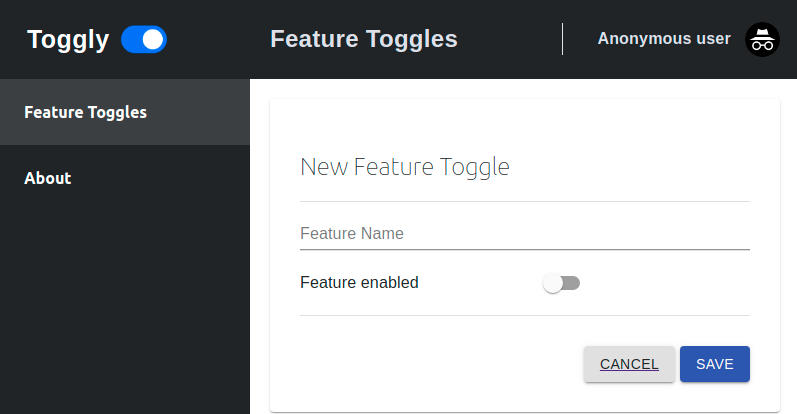

[![Docker version][docker-img]][docker-hub] [![Docker image size][docker-img-size]][docker-hub]

# Toggly UI
Manage and visualize feature toggles

|              Visualize features             |               Add/Edit features              |
| :-----------------------------------------: | :------------------------------------------: |
|  |  |

## Development

The app was built with [create-react-app](https://github.com/facebookincubator/create-react-app).

[docker-img]: https://img.shields.io/docker/v/pabloubal/toggly-ui?label=docker-hub&style=plastic
[docker-img-size]: https://img.shields.io/docker/image-size/pabloubal/toggly-ui?label=docker-image-size&style=plastic
[docker-hub]: https://hub.docker.com/r/pabloubal/toggly-ui